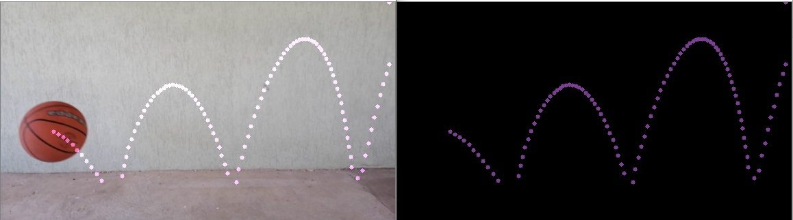
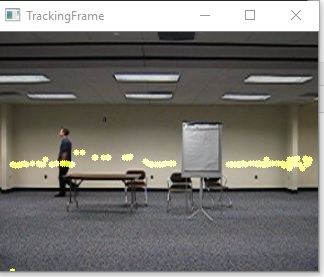
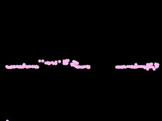
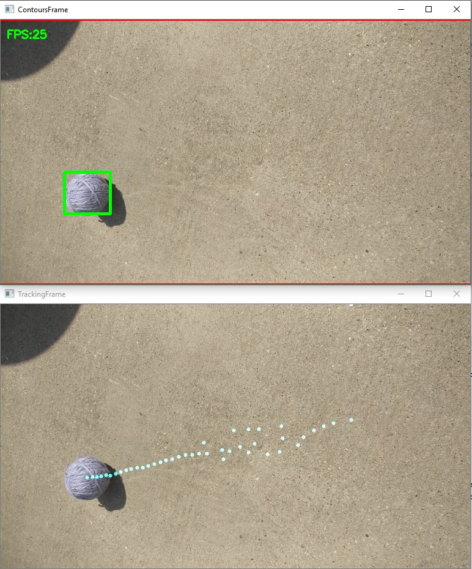
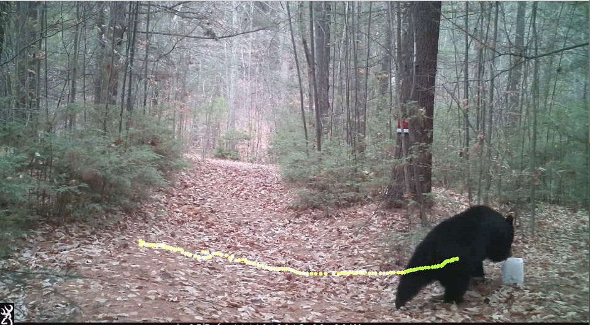
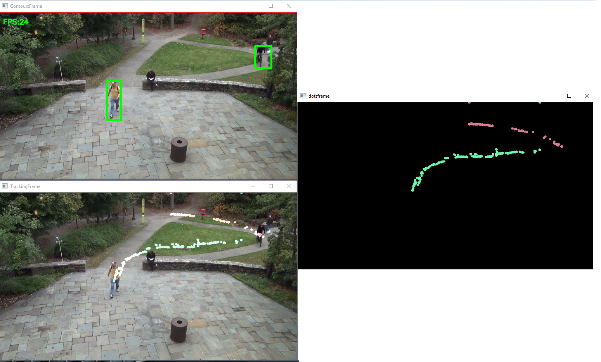

<h1>
Szegedi Tudományegyetem   Informatikai Intézet
</h1>

A dolgozat alapvetően az online azonnali feldolgozásra épít, tiszta, egyértelmű objektumokat képes követni, összehasonlítani, és előrejelzést készíteni a múltbéli mozgásuk alapján. Mindezt egy általános, autonóm, nem specializált rendszerként próbáltam implementálni, ennek a céljára igyekeztem részletes paraméterezést biztosítani a programban, illetve a rendszer felépítését átláthatóbbá, és könnyen kezelhetővé tenni.
A tesztelés során igyekeztem különböző tematikájú és helyzetű videókat használni, az ebben a fejezetben bemutatott képek a megfelelően konfigurált program futtatási eredményei.
A program képes mozgás alapján felismerni és követni objektumokat rögzített kamera szögből.

VIDEO:

|

1. Követés futtatása simple (bal) és poly (jobb) módszerrel

2. Egyedülálló egyszerű objektum követése a programmal

3. Program futtatása egy kedvező, fix kamerás felvétel, viszonylag állandó háttérrel

4. Parkban mozgó emberek követése a programmal

<h2>
SZAKDOLGOZAT
 
Sári Gábor & Dr. Nagy Antal Sándor
 
2020
 
</h2>

